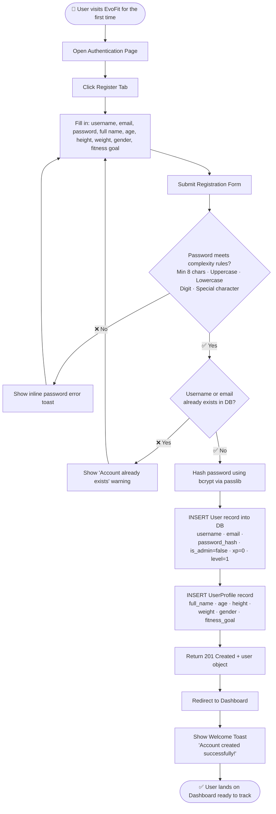
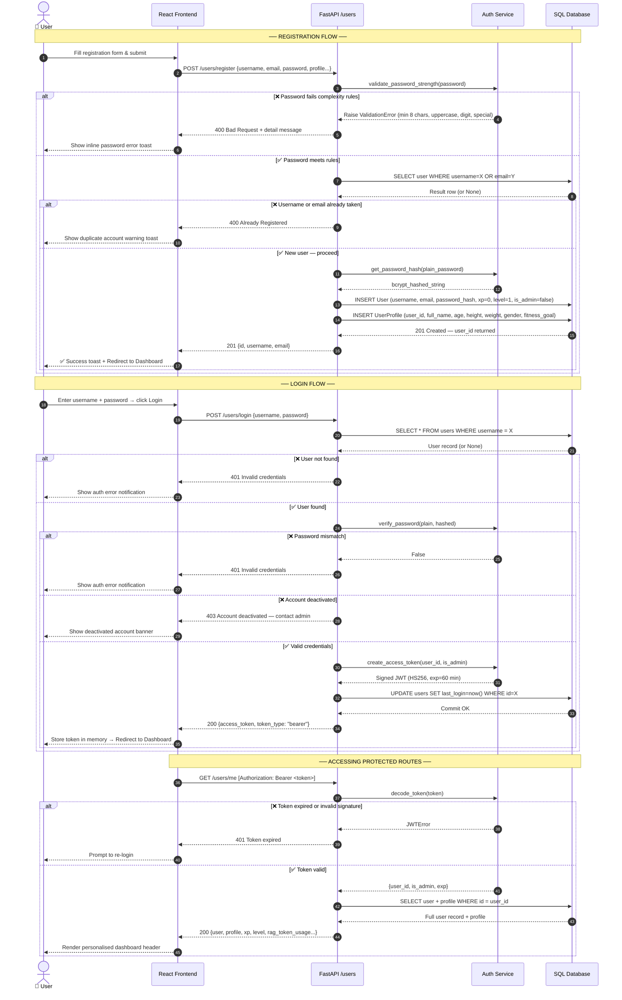
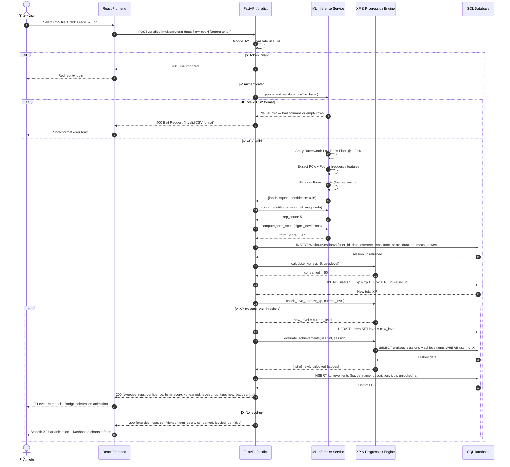
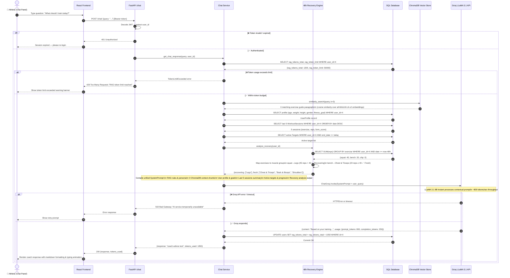
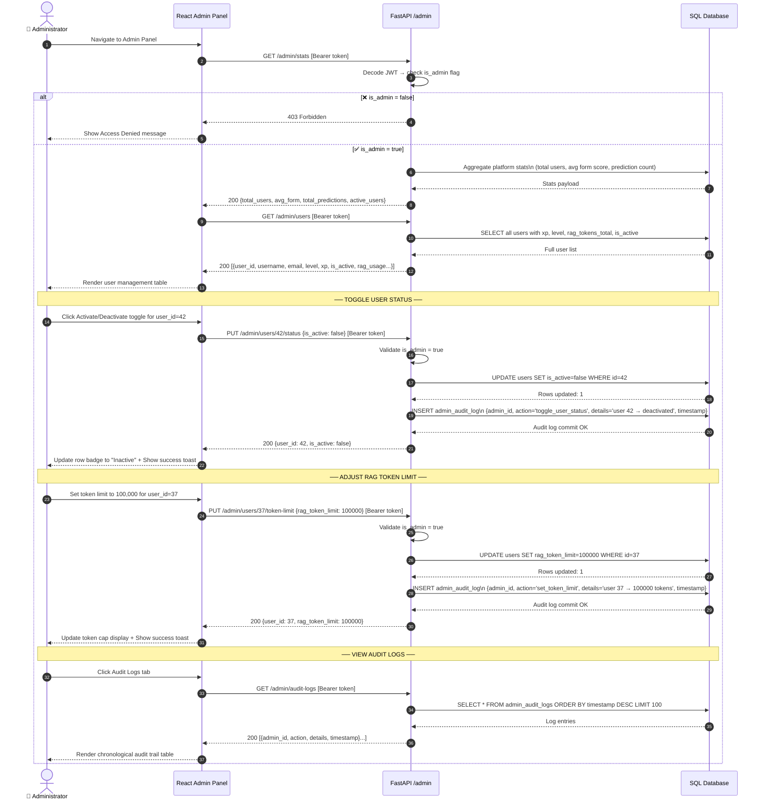

# EvoFit — Activity & Sequence Diagrams

*AI-Powered Fitness Tracking System — System Behaviour & Interaction Flows*

---

## Activity Diagrams

### 1. User Registration & Onboarding Flow

This activity diagram captures the full lifecycle of a new user registering on EvoFit, from form submission through password validation, duplicate detection, profile creation, and first-time dashboard onboarding.



---

### 2. Workout Upload, ML Classification & XP Award Flow

This diagram traces the end-to-end processing path from a user uploading a raw sensor CSV file, through ML inference, rep counting, form scoring, database persistence, and XP/level-up gamification triggers.

```mermaid
flowchart TD
    Start([🏋️ User navigates to Upload & Analyze page]) --> SelectFile[Select raw IMU sensor CSV file\n Accelerometer x,y,z + Gyroscope x,y,z @ 200ms]
    SelectFile --> ClickPredict[Click Predict & Log Workout]
    ClickPredict --> CheckToken{JWT Token\nValid & Active?}

    CheckToken -- ❌ No --> Err401[Return 401 Unauthorized]
    Err401 --> ShowAuthErr[Prompt user to log in again]
    ShowAuthErr --> End1([Session expired — redirect to login])

    CheckToken -- ✅ Yes --> ParseCSV[Parse raw CSV: validate columns, row count, sensor ranges]
    ParseCSV --> ValidFormat{CSV format\ncorrect?}

    ValidFormat -- ❌ No --> Err400[Return 400 Bad Request\n 'Invalid or empty CSV']
    Err400 --> ShowFormatErr[Show format error to user]
    ShowFormatErr --> SelectFile

    ValidFormat -- ✅ Yes --> ApplyFilter[Apply Butterworth Low-Pass Filter @ 1.3 Hz\n Smooth noisy sensor signal]
    ApplyFilter --> ExtractFeatures[Extract PCA + Fourier Frequency Features]
    ExtractFeatures --> RunRF[Random Forest Classifier Inference\n 98.51% Accuracy across 5 classes]

    RunRF --> ClassifyExercise[Classify Exercise:\n bench / dead / ohp / row / squat]
    ClassifyExercise --> CountReps[Count Repetitions\n Smoothed magnitude peak detection]
    CountReps --> ScoreForm[Score Exercise Form\n Signal deviation from ideal waveform]

    ScoreForm --> SaveSession[Save WorkoutSession to DB\n date · exercise · reps · form_score · duration · mean_power]
    SaveSession --> CalcXP[Calculate XP Earned\n reps × level_multiplier]
    CalcXP --> AddXP[Add XP to User.xp]
    AddXP --> LevelCheck{User XP ≥\nNext Level Threshold?}

    LevelCheck -- ✅ Yes --> LevelUp[Increment User.level]
    LevelUp --> CheckBadges[Scan Achievement Criteria\n Volume milestones · Streak goals · Level targets]
    CheckBadges --> UnlockedBadges{New Badges\nUnlocked?}

    UnlockedBadges -- ✅ Yes --> SaveBadges[INSERT Achievement records to DB]
    SaveBadges --> NotifyLevelBadge[🎉 Trigger Level-Up Toast + Badge Celebration Modal]
    NotifyLevelBadge --> CheckTargets

    UnlockedBadges -- ❌ No --> NotifyLevel[🎉 Trigger Level-Up Toast notification]
    NotifyLevel --> CheckTargets

    LevelCheck -- ❌ No --> CheckTargets[Check Active Weekly Targets\n Did this workout complete a target?]

    CheckTargets -- ✅ Target Complete --> NotifyTarget[🎯 Trigger Target Completion Toast]
    NotifyTarget --> ReturnResult

    CheckTargets -- ❌ No target complete --> ReturnResult[Return 200 OK JSON\n exercise · reps · confidence · form_score · xp_earned · level]

    ReturnResult --> UpdateUI[Update Dashboard UI\n Volume chart · XP bar · Form trend · Heatmap]
    UpdateUI --> End2([✅ Workout successfully classified & logged])
```



---

### 3. Target Management & Progress Tracking Flow

This diagram shows the lifecycle of weekly rep targets — creation, active monitoring during each workout upload, live progress computation, and automated completion notification.

```mermaid
flowchart TD
    Start([📌 User opens Targets page]) --> LoadTargets[GET /targets/ — Load existing active targets]
    LoadTargets --> HasTargets{Active targets\nexist?}

    HasTargets -- ✅ Yes --> ShowTargets[Display target cards with exercise, weekly goal, date range]
    HasTargets -- ❌ No --> ShowEmpty[Show empty state with Create Target prompt]

    ShowEmpty --> ClickCreate
    ShowTargets --> ClickCreate[User clicks + Create New Target]
    ClickCreate --> FillTarget[Select Exercise + Weekly Rep Goal + Date Range]
    FillTarget --> SubmitTarget[POST /targets/]
    SubmitTarget --> ValidateTarget{Date range &\ngoal valid?}

    ValidateTarget -- ❌ No --> ShowTargetErr[Show validation error]
    ShowTargetErr --> FillTarget

    ValidateTarget -- ✅ Yes --> SaveTarget[INSERT Target record to DB\n exercise · weekly_rep_target · start_date · end_date]
    SaveTarget --> ShowNewTarget[Append new target card to list]

    ShowNewTarget --> MonitorLoop{User uploads\nnew workout?}

    MonitorLoop -- ✅ Yes --> UploadWorkout[Workout is classified & saved to DB\n See Activity Diagram 2]
    UploadWorkout --> RecomputeProgress[GET /targets/progress\n Sum reps for each exercise in current week]
    RecomputeProgress --> UpdateProgressBar[Update progress bars with\n completed_reps / weekly_rep_target × 100%]
    UpdateProgressBar --> TargetMet{completed_reps ≥\nweekly_rep_target?}

    TargetMet -- ✅ Yes --> FireToast[🎯 Toast: 'Target Achieved! Well done!']
    FireToast --> MonitorLoop

    TargetMet -- ❌ No --> MonitorLoop

    MonitorLoop -- ❌ No --> DeleteOption{User wants to\ndelete a target?}

    DeleteOption -- ✅ Yes --> ConfirmDelete[Confirm deletion]
    ConfirmDelete --> DeleteTarget[DELETE /targets/{id}]
    DeleteTarget --> RemoveCard[Remove target card from UI]
    RemoveCard --> End

    DeleteOption -- ❌ No --> End([✅ Targets page reflects live progress])
```

---

### 4. Admin User Management Flow

This diagram illustrates the administrative workflow for managing users — viewing account statuses, activating/deactivating accounts, adjusting RAG token limits, and all actions being committed to the audit log.

```mermaid
flowchart TD
    Start([🔐 Admin logs in and navigates to Admin Panel]) --> ValidateAdmin{JWT token\nis_admin = true?}

    ValidateAdmin -- ❌ No --> Err403[Return 403 Forbidden]
    Err403 --> End1([Access denied — redirect to dashboard])

    ValidateAdmin -- ✅ Yes --> LoadStats[GET /admin/stats\n total_users · avg_form · total_predictions · active_users]
    LoadStats --> LoadUsers[GET /admin/users\n Full user list with status, xp, level, token usage]
    LoadUsers --> ShowAdminPanel[Render Admin Dashboard\n Stats cards · User management table · Audit log]

    ShowAdminPanel --> AdminAction{Admin selects\nan action}

    AdminAction --> ToggleStatus[Toggle User Active / Inactive Status]
    ToggleStatus --> PutStatus[PUT /admin/users/{id}/status\n is_active: true / false]
    PutStatus --> LogStatus[INSERT admin_audit_log\n admin_id · action='toggle_status' · details · timestamp]
    LogStatus --> RefreshUsers[Refresh user table row]
    RefreshUsers --> ShowToastAction[Show 'User status updated' toast]
    ShowToastAction --> AdminAction

    AdminAction --> AdjustTokens[Adjust User RAG Token Limit]
    AdjustTokens --> InputLimit[Enter new token cap value]
    InputLimit --> PutToken[PUT /admin/users/{id}/token-limit\n rag_token_limit: N]
    PutToken --> LogToken[INSERT admin_audit_log\n action='set_token_limit' · details]
    LogToken --> RefreshUsers

    AdminAction --> ViewAuditLogs[View Audit Logs]
    ViewAuditLogs --> GetLogs[GET /admin/audit-logs\n Paginated chronological admin actions]
    GetLogs --> ShowLogs[Render log table: admin · action · details · timestamp]
    ShowLogs --> AdminAction

    AdminAction --> CheckHealth[Check System Health]
    CheckHealth --> GetSystemStatus[GET /admin/system-status\n DB connectivity · cache state · error rates]
    GetSystemStatus --> ShowHealth[Render health indicators: DB ✅ · Cache ✅ · Errors ✅]
    ShowHealth --> FlushNeeded{Cache flush\nrequired?}

    FlushNeeded -- ✅ Yes --> FlushCache[POST /admin/system/flush-cache\n Reset global in-memory metrics counters]
    FlushCache --> LogFlush[INSERT admin_audit_log\n action='flush_cache']
    LogFlush --> ShowFlushSuccess[Show 'Cache flushed successfully' toast]
    ShowFlushSuccess --> AdminAction

    FlushNeeded -- ❌ No --> AdminAction

    AdminAction --> End2([✅ Admin tasks complete — audit trail preserved])
```

---

## Sequence Diagrams

### 5. Authentication — Registration & Login Sequence

This sequence diagram covers the full transaction lifecycle for a new user registering and an existing user logging in, including password validation, bcrypt hashing, JWT issuance, and protected route access.



---

### 6. Workout CSV Upload & XP Award Sequence

This sequence diagram details the precise API transaction chain when a user uploads a sensor CSV file — from authentication to ML inference, database writes, XP calculation, and level-up celebration triggers.



---

### 7. RAG AI Coach Chat Request Sequence

This sequence diagram shows every layer of the RAG pipeline — from the user's chat query through JWT validation, ChromaDB semantic search, SQL context injection, 48-hour recovery analysis, Groq LLM inference, and token usage persistence.



---

### 8. Admin Panel — Audit-Safe Action Sequence

This sequence diagram shows how an administrator performs privileged actions (toggling user status and adjusting token limits) with full RBAC enforcement, audit trail persistence, and UI feedback.



---

## Diagram Summary

| # | Type | Name | Key Flow Covered |
|---|---|---|---|
| 1 | Activity | User Registration & Onboarding | Password rules → bcrypt → DB insert → Dashboard redirect |
| 2 | Activity | Workout Upload & ML Classification | CSV → Butterworth → RF Predict → XP → Level-up → Badges |
| 3 | Activity | Target Management & Progress | Create target → Monitor workouts → Progress bars → Completion toast |
| 4 | Activity | Admin User Management | RBAC check → Stats → Toggle status → Token limit → Audit log |
| 5 | Sequence | Auth Registration & Login | Form → Validate → Hash → JWT → Protected route access |
| 6 | Sequence | CSV Upload & XP Award | Multipart upload → ML → DB session → XP → Level celebration |
| 7 | Sequence | RAG AI Coach Chat | Query → Token check → ChromaDB → SQL context → Recovery → Groq → Response |
| 8 | Sequence | Admin Panel Actions | RBAC → Stats → Toggle/Token → Audit trail commit |
