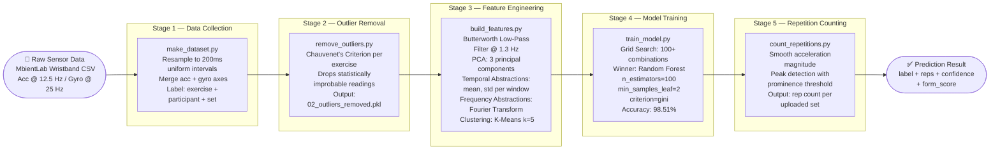
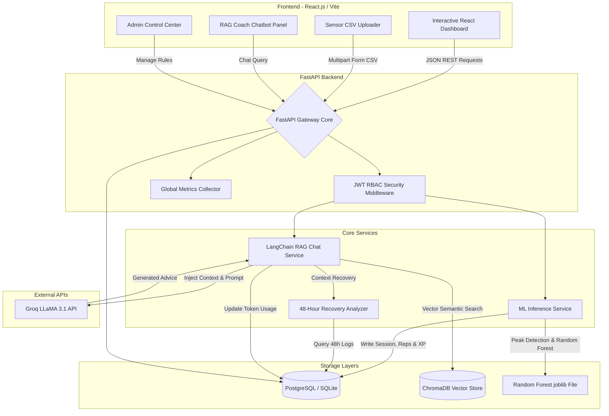
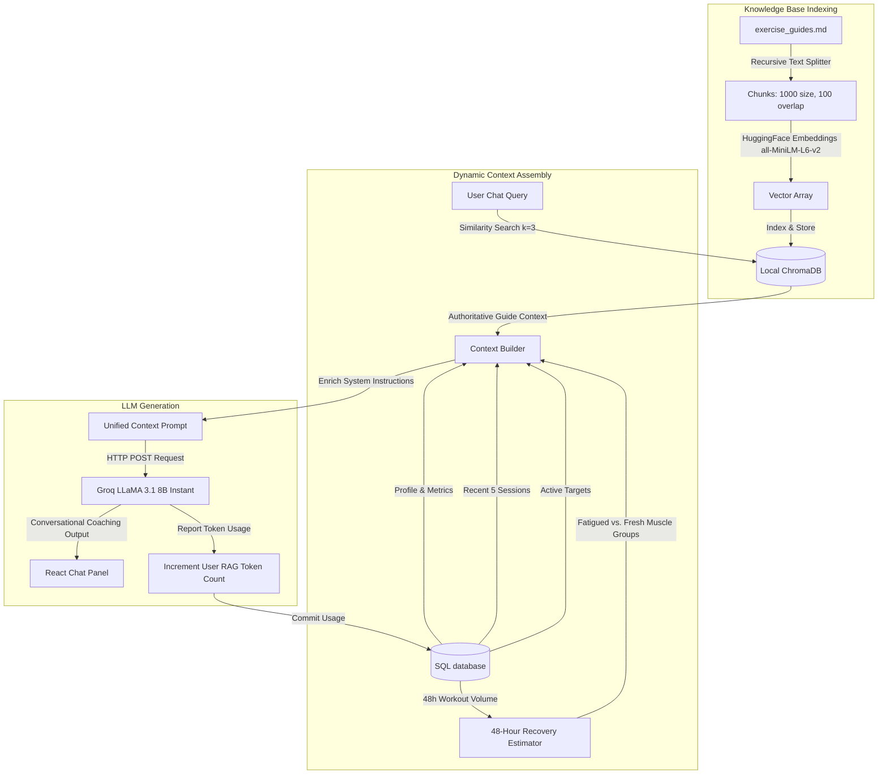
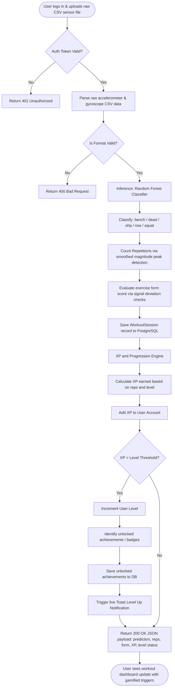
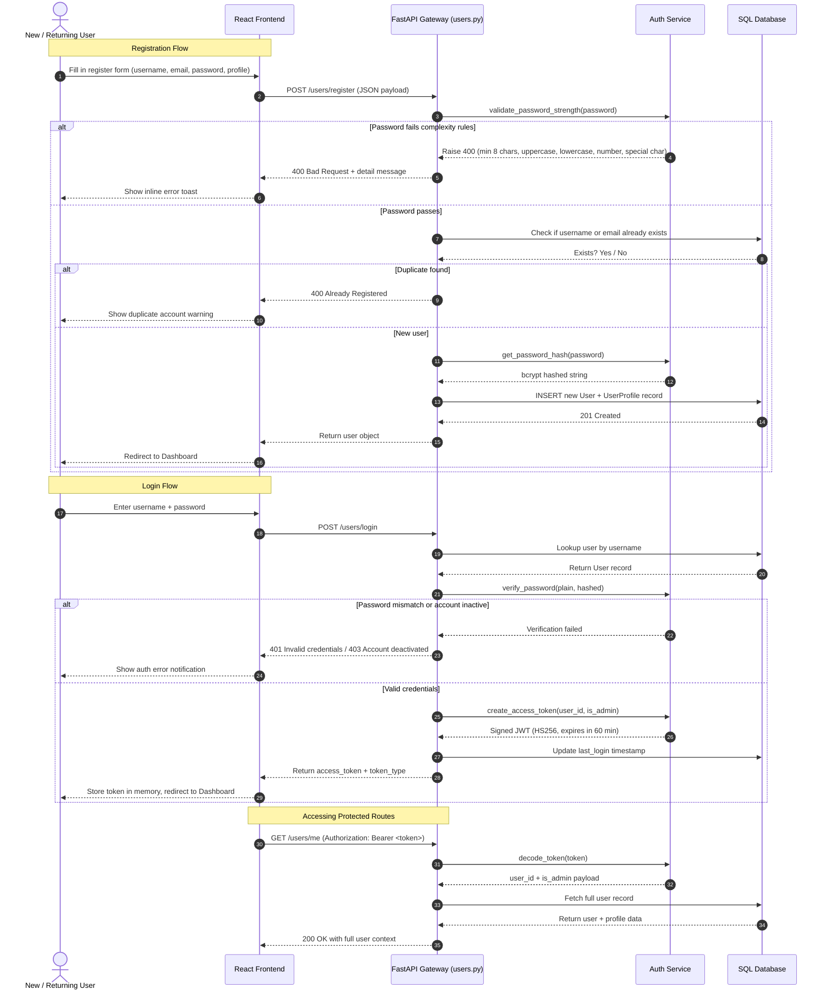
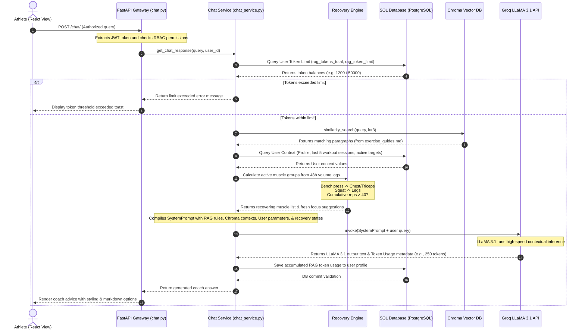

# EvoFit Project Documentation Guide
*AI-Powered Full-Stack Fitness Tracking System*

---

## 1. Project Overview

### 1.1 Purpose & Problem Solved
Strength training is a fundamental component of physical fitness, but current commercial wearable technology (e.g., Apple Watch, Fitbit) is highly optimized for cardiovascular activities (running, cycling) and offers virtually no automated tracking for free-weight exercises. 

**EvoFit** is an AI-powered full-stack fitness tracking ecosystem designed to bridge this gap. By utilizing motion data collected from a wristband accelerometer and gyroscope, EvoFit automatically:
1. **Classifies Barbell Exercises** (Bench Press, Deadlift, Overhead Press, Barbell Row, and Squats).
2. **Counts Repetitions** with a high-accuracy peak detection algorithm.
3. **Scores Exercise Form** using sensor signal deviations.
4. **Tracks Gamified Progression** with levels and Experience Points (XP).
5. **Provides a Retrieval-Augmented Generation (RAG) Coach** that cross-references the user's actual workout logs with academic exercise guides to give personalized training advice, recovery analysis, and muscle fatigue forecasts.

### 1.2 Goals and Objectives
* **Machine Learning Excellence**: Deliver an ML pipeline with >95% (currently **98.51%**) classification accuracy across five fundamental barbell movements.
* **Intelligent Rep Counter**: Build a peak detection system capable of counting sets and repetitions automatically from raw sensor acceleration magnitudes.
* **Interactive Dashboard**: Create a fully responsive, modern React visualization panel with charts illustrating historical volume, accuracy, and form tracking.
* **Context-Aware RAG Assistant**: Incorporate a localized LLM coach using a vector database (ChromaDB) to answer training questions based directly on the user's 48-hour recovery profile, historic metrics, and targets.
* **Enterprise Security & Control**: Establish strict Role-Based Access Control (RBAC) separating administrators from standard users, with full audit logging and RAG token enforcement.

### 1.3 Scope
* **In-Scope**:
  * Upload and parsing of uniform 200ms sensor data CSV files.
  * Multi-class classification (5 exercises) using a Random Forest model.
  * Real-time automated XP accumulation and tiered level progression.
  * Dynamic weekly targets management with automated notifications.
  * Personal RAG Coach powered by LangChain, ChromaDB, and Groq API.
  * Complete Administrator control center (user activation/deactivation, token limits, system metric dashboards, audit logs).
* **Out-of-Scope**:
  * Real-time video/camera analysis (focuses entirely on inertial measurement unit (IMU) wrist sensor arrays).
  * Direct bluetooth pairing in the web browser (relies on exported sensor logs uploads).
  * Machine-based exercise tracking (cables, smith machines).

### 1.4 Target Audience
* **Strength Training Athletes**: Looking to digitize free-weight metrics without manual journal logs.
* **Coaches & Trainers**: Seeking hard telemetry to audit client exercise form and workout frequency.
* **Fitness Enthusiasts**: Who want personalized, AI-driven coaching suggestions tailored to their active muscle fatigue cycles.

---

## 2. Requirements

### 2.1 Functional Requirements
* **Authentication & Profiles**:
  * Users must register with strict password validation rules (minimum 8 characters, 1 uppercase letter, 1 lowercase letter, 1 number, and 1 special character).
  * JWT-based login with automatic token refresh/expiration handling.
  * User profiles storing static metrics (age, gender, height) and dynamic metrics (historical weights, body fat logs).
* **Core ML & Uploads**:
  * Secure endpoints to upload raw CSV files containing accelerometer/gyroscope signals.
  * Automatic prediction response mapping predicted exercises, reps count, and classification confidence scores.
  * Automatically allocate XP based on reps completed and updated profile levels.
* **Target Setting & Progress**:
  * Create, delete, and monitor weekly goals per exercise.
  * Calculate live completion ratios (completed reps vs. target reps) and prompt toast notifications for target completions.
* **AI Chat Coach**:
  * Personalized chat system responding to workout questions.
  * Automated recovery analyzer assessing 48-hour exercise history to declare muscle group statuses (e.g., Chest & Triceps recovering) and suggest fresh focuses.
* **Administrative Controls**:
  * Restrict `/admin/*` endpoints to administrative roles via JWT RBAC validation.
  * Admin ability to update user status (active/deactive) and set custom daily/monthly RAG token limits.
  * Global system status reporting (DB, cache, metrics flush) and administrative audit trails.

### 2.2 Non-Functional Requirements
* **Performance**: 
  * Predictions `/predict/` must complete execution in under 500ms on a single-core CPU configuration.
  * Dashboard queries must load historic data streams under 200ms.
* **Security**:
  * Passwords hashed via high-entropy `bcrypt` configurations.
  * SQL injection mitigation via SQLAlchemy parameterized query construction.
  * Clean division of access layers (Admins vs. Users) with 403 Forbidden returns on privilege breaches.
* **Scalability & Portability**:
  * Decoupled backend architecture running FastAPI with modular routing tables.
  * Local configuration fallback enabling SQLite during unit tests and automated PostgreSQL switching in production.

### 2.3 System Constraints
* **Sensor Sample Frequency**: Input CSV data must correspond to Resampled Uniform 200ms sensor interval sequences.
* **Third-Party Keys**: System operations require a valid `GROQ_API_KEY` for LLM completions.
* **Local Storage**: ChromaDB vector indices are stored on the filesystem within the application context.

---

## 3. Machine Learning Pipeline (Deep-Dive)

The ML pipeline is the intelligence core of EvoFit. It transforms raw 6-axis IMU sensor streams into accurate exercise labels, rep counts, and form scores across **5 stages**.

### 3.1 Pipeline Flowchart



### 3.2 Stage-by-Stage Breakdown

| Stage | Script | Input | Output | Key Technique |
| :--- | :--- | :--- | :--- | :--- |
| **1. Data Collection** | `make_dataset.py` | Raw MbientLab CSVs (acc + gyro) | `01_data_processed.pkl` | Resampling to 200ms uniform intervals |
| **2. Outlier Removal** | `remove_outliers.py` | `01_data_processed.pkl` | `02_outliers_removed.pkl` | Chauvenet's Criterion per exercise class |
| **3. Feature Engineering** | `build_features.py` | `02_outliers_removed.pkl` | `03_data_features.pkl` | Butterworth filter, PCA, Fourier, K-Means |
| **4. Model Training** | `train_model.py` | `03_data_features.pkl` | `model.pkl` (joblib) | Random Forest via Grid Search CV |
| **5. Rep Counting** | `count_repetitions.py` | Any processed set | `rep_count` integer | Smoothed magnitude peak detection |

### 3.3 Model Performance Summary

| Metric | Value |
| :--- | :--- |
| **Algorithm** | Random Forest (scikit-learn) |
| **Hyperparameters** | `n_estimators=100`, `min_samples_leaf=2`, `criterion=gini` |
| **Training Accuracy** | **98.51%** |
| **Number of Classes** | 5 (`bench`, `dead`, `ohp`, `row`, `squat`) |
| **Training Participants** | 5 individuals (VU Amsterdam dataset) |
| **Input Features** | Accelerometer (x,y,z) + Gyroscope (x,y,z) + PCA + Fourier coefficients |
| **Model Format** | Serialized via `joblib` → `ml/models/model.pkl` |

---

## 4. Security Architecture

### 4.1 Role-Based Access Control (RBAC)

EvoFit enforces a strict two-tier RBAC model. Every protected endpoint checks the JWT payload's `is_admin` flag before processing the request.

| Permission | Regular User | Administrator |
| :--- | :---: | :---: |
| Register & Login | ✅ | ✅ |
| View own profile & XP | ✅ | ✅ |
| Upload sensor CSV & get predictions | ✅ | ✅ |
| Set and view workout targets | ✅ | ✅ |
| Access AI RAG Chat Coach | ✅ | ✅ |
| View global leaderboard | ✅ | ✅ |
| View cohort comparison | ✅ | ✅ |
| Access `/admin/stats` | ❌ | ✅ |
| List all user accounts | ❌ | ✅ |
| Activate / deactivate any user | ❌ | ✅ |
| Update RAG token limits | ❌ | ✅ |
| View admin audit logs | ❌ | ✅ |
| Flush system cache & metrics | ❌ | ✅ |

### 4.2 JWT Token Structure

Tokens are signed using **HS256** and expire after a configurable duration (default 60 minutes).

```json
{
  "header": {
    "alg": "HS256",
    "typ": "JWT"
  },
  "payload": {
    "sub": "<user_id>",
    "is_admin": false,
    "exp": 1748865600
  },
  "signature": "<HMAC-SHA256 of header.payload using JWT_SECRET>"
}
```

### 4.3 Password Security Policy

All passwords are validated on registration against the following enforced rules:

| Rule | Requirement |
| :--- | :--- |
| Minimum Length | 8 characters |
| Uppercase Letter | At least 1 required |
| Lowercase Letter | At least 1 required |
| Numeric Digit | At least 1 required |
| Special Character | At least 1 required (`!@#$%^&*`) |
| Storage | `bcrypt` hash via `passlib[bcrypt]` — never stored in plain text |

---

## 5. Architecture & Design

### 3.1 High-Level System Architecture

The following diagram illustrates the high-level system architecture of EvoFit, tracing data flow from the hardware sensor CSV upload to the ML engine, database layers, and the personalized RAG chatbot:



### 3.2 Database Schema

EvoFit employs a highly structured relational database system managed by SQLAlchemy. Below are the key data models and their specifications:

| Table Name | Primary Key | Foreign Keys | Key Attributes | Purpose |
| :--- | :--- | :--- | :--- | :--- |
| **`users`** | `id` (Int) | None | `username` (Unique String)<br>`email` (Unique String)<br>`password_hash` (String)<br>`xp` (Int, default 0)<br>`level` (Int, default 1)<br>`is_admin` (Bool)<br>`is_active` (Bool)<br>`rag_token_limit` (Int, default 50000) | Stores core account details, security flags, progression status, and AI usage limitations. |
| **`user_profiles`** | `id` (Int) | `user_id` -> `users.id` | `full_name` (String)<br>`age` (Int)<br>`weight_kg` (Float)<br>`height_cm` (Float)<br>`gender` (String)<br>`fitness_goal` (String) | Keeps demographic parameters used to calibrate metabolic predictions and RAG advice. |
| **`workout_sessions`**| `id` (Int) | `user_id` -> `users.id` | `date` (Date)<br>`exercise` (String)<br>`reps_actual` (Int)<br>`form_score` (Float)<br>`duration_sec` (Float)<br>`mean_power` (Float)<br>`json_report` (Text) | Logs details of successfully classified workout sensor streams, reps, and form ratings. |
| **`targets`** | `id` (Int) | `user_id` -> `users.id` | `exercise` (String)<br>`weekly_rep_target` (Int)<br>`start_date` (Date)<br>`end_date` (Date) | Stores user-defined fitness targets and period guidelines. |
| **`achievements`** | `id` (Int) | `user_id` -> `users.id` | `badge_name` (String)<br>`description` (String)<br>`icon` (String)<br>`unlocked_at` (DateTime) | Gamification badges unlocked by completing volume milestones. |
| **`body_metrics`** | `id` (Int) | `user_id` -> `users.id` | `weight` (Float)<br>`body_fat_pct` (Float)<br>`log_date` (Date) | Tracks continuous physical development changes over time. |
| **`admin_audit_logs`**| `id` (Int) | `admin_id` -> `users.id` | `action` (String)<br>`details` (String)<br>`timestamp` (DateTime) | Security-audit logs detailing administrator actions (e.g., updating user status, shifting token thresholds). |

### 3.3 Tech Stack & Rationale
* **Backend Framework: FastAPI (Python 3.10+)**
  * *Rationale*: Outstanding asynchronous performance (async/await), automatic Pydantic input validation, native OpenAPI generation, and seamless integration with standard Python data science tooling.
* **Frontend Library: React.js (Vite Core Compiler)**
  * *Rationale*: Offers hot-reloading for rapid UI development, clean component encapsulation, and high-performance rendering of charts via Recharts. Tailwind CSS is used to build a beautiful design with responsive layout support.
* **Core ML Engine: scikit-learn (Random Forest Model)**
  * *Rationale*: Achieves **98.51%** classification accuracy. A Random Forest ensemble offers negligible latency under low CPU usage, avoiding the need for expensive GPU infrastructure required by Recurrent Neural Networks (LSTMs).
* **RAG Orchestrator & Vector Base: LangChain & ChromaDB**
  * *Rationale*: Local filesystem vector persistence, fast cosine-similarity indexing, and structured abstraction interfaces to orchestrate context generation with cloud API providers.
* **LLM Engine: Groq API (`llama-3.1-8b-instant`)**
  * *Rationale*: Lightning-fast token throughput (often over 800 tokens per second) at minimal cost, yielding high-quality, conversational coaching advice.

### 3.4 Design Decisions & Trade-Offs
1. **Wearable CSV Uploader vs. WebBluetooth**
   * *Decision*: Implemented file-based CSV uploads. While real-time bluetooth connections would make recording direct, developing custom firmware connections on varying browser standards poses critical reliability trade-offs. Raw CSV logs provide a reliable, universal standard.
2. **Chauvenet's Outlier Criterion vs. Isolation Forest**
   * *Decision*: Applied Chauvenet's Criterion for ML outlier cleaning. Because the physical metrics are strictly bound by anatomical parameters, standard statistical deviations offer clean, predictable noise reduction without the overfitting risks associated with automated outlier models.

### 3.5 Detailed RAG (Retrieval-Augmented Generation) Architecture

EvoFit incorporates a highly customized, closed-loop **Retrieval-Augmented Generation (RAG)** service that delivers localized, hyper-personalized athletic coaching. The system combines static authoritative knowledge indices with dynamic user physiological logs to minimize LLM hallucinations.



#### Key Architecture Components of the RAG System:
1. **Vector Storage & Semantic Retrieval**:
   * **Source Documents**: authoritative guide sheets (`data/knowledge/exercise_guides.md`) outlining correct lift mechanics, safety guidelines, and physiological triggers.
   * **Embedding Engine**: Local pipeline running `all-MiniLM-L6-v2` via HuggingFace transformers, producing high-density semantic vector coordinate spaces.
   * **Vector Store**: A file-persisted ChromaDB database configured in `backend/services/chat_service.py` to retrieve the top $k=3$ matches matching the user's inquiry.
2. **Dynamic SQL Contextual Injection**:
   * **Demographic State**: Captures height, current weight, age, and fitness goals to configure physical response frames.
   * **Historical Baseline**: Summarizes the last 5 completed workout sessions, capturing exercise, actual completed reps, and form accuracy scores.
   * **Target Benchmarks**: Lists active weekly rep goals and computes live completion metrics.
3. **The 48-Hour Recovery Engine**:
   * **Logic**: Queries the relational database for any completed repetitions logged by the user in the past 48 hours.
   * **Fatigue Mapping**: Maps workouts to physiological groups: `bench` $\rightarrow$ *Chest & Triceps*, `ohp` $\rightarrow$ *Shoulders & Triceps*, `squat` $\rightarrow$ *Legs*, `dead` $\rightarrow$ *Legs & Lower Back*, and `row` $\rightarrow$ *Back & Biceps*.
   * **Trigger Limit**: If cumulative repetitions in any muscle group exceed **40 reps**, that group is flagged as **"Recovering"** (requiring 48 hours recovery). Remaining groups are flagged as **"Fresh"**.
   * **Outcome**: Automatically appends recommendations to the chat context (e.g. *Legs are recovering. Suggest next focus: Back & Biceps.*).
4. **Security & Token Limits Safeguards**:
   * **Vulnerability Mitigations**: To prevent infinite loop loops or malicious exhaustion of public LLM endpoints, the user table maintains a `rag_tokens_total` and an administrator-adjustable `rag_token_limit` (default 50,000 tokens).
   * **Assertion Check**: If the user's total token count exceeds their personal cap, the request is blocked, throwing an informative warning.
   * **Usage Persistence**: The response payload metadata extracts exact completion and prompt usage from Groq's output headers, committing the updated totals to the SQLite/PostgreSQL database instantly.

---

### 3.6 System Workflows (Activity & Sequence Diagrams)

To illustrate how the system acts on input streams, the following diagrams demonstrate the activity flow of uploading data and the sequence breakdown of RAG assistant requests.

#### 1. Activity Diagram: Workout Session Classification and XP Level Up Flow

This workflow illustrates how a user's raw IMU sensor stream is processed through machine learning validation, logged to persistent databases, and processed by the user progression engine to generate experience points and level-up awards.



#### 2. Sequence Diagram: Authentication & Login Flow

This sequence diagram shows the registration and login transaction lifecycle, including password validation, password hashing, JWT token generation, and how protected routes are accessed by the React frontend.



#### 3. Sequence Diagram: RAG Chat Assistant Request Flow

This sequence diagram shows the step-by-step API transaction lifecycle when a user consults the EvoFit RAG Chat Coach, illustrating how user variables are bound with Chroma vector data and processed securely using administrative tokens.



---

## 4. Setup & Installation

### 4.1 Prerequisites
Make sure your development machine has the following tools installed:
* **Python 3.10** or higher
* **Node.js 18.x** or higher (with npm)
* **Git**
* A valid **Groq API Key** (for RAG features)

### 4.2 Step-by-Step Installation

#### 1. Clone the Repository
```bash
git clone https://github.com/your-username/EvoFit.git
cd EvoFit
```

#### 2. Configure Environment Variables
Create a `.env` file in the root workspace directory:
```env
# Backend Database settings
DATABASE_URL=sqlite:///./evofit.db

# Security & JWT Tokens
JWT_SECRET=super_secret_jwt_generation_key_32_chars_long
ACCESS_TOKEN_EXPIRE_MINUTES=60

# AI Configuration
GROQ_API_KEY=gsk_your_actual_groq_api_key_goes_here
```

#### 3. Backend Setup & Virtual Environment
```bash
# Create virtual environment
python -m venv venv

# Activate virtual environment
# On Windows:
.\venv\Scripts\activate
# On Linux/macOS:
source venv/bin/activate

# Install dependencies
pip install -r requirements.txt
```

#### 4. Prepare the Database & Seed Admin Accounts
EvoFit includes helper scripts to prepare, initialize, and seed mock data:
```bash
# Seed initial lookup guides, users, metrics, and workout logs
python seed_data.py

# Create a default administrator user:
# Admin username: evofit_admin
# Admin password: AdminPass_123
python create_admin.py
```

#### 5. Frontend Setup
```bash
cd frontend
npm install
```

### 4.3 Running the Application Locally

#### Start the Backend API
From the root directory (with your `venv` active):
```bash
# Runs the API on http://localhost:8000
python -m uvicorn backend.main:app --reload
```
You can view the interactive API docs (Swagger UI) at: `http://localhost:8000/docs`.

#### Start the Frontend Server
In a new terminal window, navigate to the `frontend` folder:
```bash
# Runs the Vite dev server on http://localhost:5173
npm run dev
```

---

## 5. Usage Guide

### 5.1 API Reference

All endpoints require a `Bearer <token>` in the `Authorization` header unless marked as **Public**.

| Method | Endpoint | Auth | Description |
| :--- | :--- | :---: | :--- |
| `POST` | `/users/register` | Public | Register a new user account with full profile data |
| `POST` | `/users/login` | Public | Authenticate and receive a JWT access token |
| `GET` | `/users/me` | User | Get current logged-in user profile and XP stats |
| `PUT` | `/users/me/profile` | User | Update demographic profile (age, weight, fitness goal) |
| `GET` | `/users/leaderboard` | User | Fetch global XP leaderboard with user percentile ranking |
| `POST` | `/predict/` | User | Upload sensor CSV file for ML classification and rep counting |
| `GET` | `/predict/metrics` | Public | Get ML model accuracy, confusion matrix, and class list |
| `GET` | `/targets/` | User | List all active weekly rep targets for the current user |
| `POST` | `/targets/` | User | Create a new weekly exercise rep target |
| `DELETE` | `/targets/{id}` | User | Delete a specific target by ID |
| `GET` | `/targets/progress` | User | Get live completion % for all active targets |
| `GET` | `/dashboard/summary` | User | Fetch complete dashboard summary (volume, form, XP, streaks) |
| `GET` | `/sessions/` | User | List all logged workout sessions with exercise breakdown |
| `GET` | `/achievements/` | User | List all earned badges and achievement unlock history |
| `GET` | `/activity-heatmap/` | User | Fetch workout frequency heatmap data (365-day view) |
| `GET` | `/cohort/comparison` | User | Get community average stats and personalized coaching insights |
| `POST` | `/chat/` | User | Send a query to the RAG AI Coach and receive a response |
| `GET` | `/admin/stats` | Admin | Platform-wide usage stats (total users, avg form, predictions) |
| `GET` | `/admin/users` | Admin | List all users with their account status and stats |
| `PUT` | `/admin/users/{id}/status` | Admin | Activate or deactivate a user account |
| `PUT` | `/admin/users/{id}/token-limit` | Admin | Set a custom RAG token cap for a specific user |
| `GET` | `/admin/audit-logs` | Admin | View chronological log of all admin actions |
| `GET` | `/admin/system-status` | Admin | Check live database, cache, and error rate health status |
| `POST` | `/admin/system/flush-cache` | Admin | Reset global in-memory metrics and error counters |

### 5.2 Primary User Workflows

#### 1. Sign Up & Profile Set Up
1. Visit `http://localhost:5173` and click **Register**.
2. Create an account with a strong password. 
3. Set your parameters (Age, Weight, Height, and Fitness Goals). These variables personalize calorie and workload calculations.

#### 2. Record & Upload a Workout Session
1. In the sidebar, navigate to the **Upload & Analyze** tab.
2. Upload a compatible sensor CSV log (format templates are provided in the `/data` folder).
3. Click **Predict and Log Workout**. 
4. The system will display the predicted exercise (e.g., Squat), rep count, classification confidence, form score, and XP awarded.

#### 3. Set Targets & Progress Tracking
1. Go to the **Targets** page.
2. Create a weekly rep target (e.g., 150 squats from May 22 to May 29).
3. The dashboard automatically monitors uploaded sets, updating completion progress bars in real-time.

#### 4. Consult the AI RAG Coach
1. Click the **AI Coach Chat** icon.
2. Ask questions such as: *"Based on my recent training, what should I work on today?"*
3. The coach queries your 48-hour volume history, notices your muscle fatigue status, queries standard performance documentation, and delivers customized technique tips.

---

## 6. Folder/Code Structure

### 6.1 Repository Tree Layout
```text
EvoFit/
│
├── backend/                       # FastAPI Server Root
│   ├── core/                      # Global configurations, tokens, and core metrics
│   ├── database/                  # Connection configs and SQLAlchemy ORM schemas
│   │   ├── database.py
│   │   └── models.py
│   ├── routers/                   # API Endpoints (separated by module)
│   │   ├── admin.py               # Admin control center & RBAC enforcement
│   │   ├── chat.py                # RAG AI Coach endpoint
│   │   ├── cohort.py              # Community comparison & coaching insights
│   │   ├── dashboard.py           # Summary, streaks & analytics aggregation
│   │   ├── predict.py             # ML model upload, classification & XP award
│   │   ├── sessions.py            # Workout session history listings
│   │   ├── target_analysis.py     # Target completion deep-dive analytics
│   │   ├── targets.py             # Weekly rep targets CRUD
│   │   ├── activity_heatmap.py    # 365-day workout frequency heatmap data
│   │   ├── achievements.py        # Badge unlock & achievement history
│   │   └── users.py               # Auth, profiles & leaderboard
│   ├── services/                  # Business logic classes
│   │   ├── auth_service.py        # Encryption and JWT routines
│   │   └── chat_service.py        # LangChain, HuggingFace & Groq RAG pipelines
│   ├── tests/                     # Backend Automated Test Suite
│   └── main.py                    # Gateway main script
│
├── ml/                            # Machine Learning Pipeline
│   ├── data_pipeline/             # Dataset acquisition and preprocessing
│   ├── features/                  # Butterworth filtering, PCA, & peak detection
│   │   ├── build_features.py
│   │   └── count_repetitions.py   # Repetitions counting engine
│   └── models/                    # Model definition and grid search scripts
│       └── train_model.py
│
├── data/                          # Shared data persistence
│   ├── chroma_db/                 # ChromaDB Vector index database
│   ├── raw/                       # Original sensor data CSV files
│   └── knowledge/                 # Markdown exercise guide databases
│
├── frontend/                      # React Frontend application
│   ├── src/
│   │   ├── components/            # Shared UI components
│   │   ├── context/               # Global states (Auth, Toast notification)
│   │   ├── pages/                 # Full view layouts (Dashboard, Admin, Analytics)
│   │   └── App.jsx
│   ├── package.json
│   └── tailwind.config.js
│
├── requirements.txt               # Global Python libraries list
└── run_tests.py                   # Testing suite execution gateway
```

---

## 7. Testing

EvoFit features a robust, unified testing framework covering unit logic, integration routes, security controls, and end-to-end classification tasks.

### 7.1 Unified Test Suite (PyTest)
The backend routes and logic are validated via an isolated SQLite test database.

**To run the test suite:**
```bash
# Activates PyTest runner against backend tests
python run_tests.py
```

The test suite validates:
1. **Security & Hashing**: Password complexity criteria, token expirations, and correct role assertions.
2. **Access Control (RBAC)**: Ensuring ordinary accounts are rejected from accessing `/admin/` stats and audit paths.
3. **Crud Systems**: Target validation, progress tracking, and session registrations.
4. **Mocked AI Engines**: Validates RAG token counters without using paid Groq API tokens.

### 7.2 End-to-End Prediction Verification
EvoFit provides an E2E pipeline script that logs into the running server, reads part of the processed dataset, simulates actual sensor uploads, and prints a tabular score report.

**To run the E2E verification test:**
1. Make sure the backend server is running locally (`python -m uvicorn backend.main:app`).
2. Execute the verification script:
```bash
python e2e_test.py
```

*Example Output:*
```text
[*] Authenticating with http://localhost:8000...
[+] Login successful. Token acquired.

[*] Running E2E Prediction Tests against http://localhost:8000/predict/ ...
+------------+-------------+--------+--------------+----------+
| Exercise   | Predicted   | Reps   | Confidence   | Result   |
+============+=============+========+==============+==========+
| bench      | bench       | 5      | 99%          | PASS     |
+------------+-------------+--------+--------------+----------+
| dead       | dead        | 5      | 100%         | PASS     |
+------------+-------------+--------+--------------+----------+
| squat      | squat       | 5      | 98%          | PASS     |
+------------+-------------+--------+--------------+----------+
3/3 correct
```

---

## 8. Deployment

### 8.1 Docker Multi-Container Architecture
EvoFit is fully containerized, splitting backend services, frontend static hosts, and production databases.

#### Structure Setup
1. **Dockerfile (Backend)**: Builds Python virtual environments, installs requirements, and boots Uvicorn servers.
2. **Dockerfile (Frontend)**: Runs node compilations and exports static distribution files.
3. **docker-compose.yml**: Orchestrates the multi-container configuration:
```yaml
version: '3.8'

services:
  db:
    image: postgres:15
    environment:
      POSTGRES_DB: evofit
      POSTGRES_USER: evofit_admin
      POSTGRES_PASSWORD: secure_password
    volumes:
      - pgdata:/var/lib/postgresql/data

  backend:
    build: ./backend
    ports:
      - "8000:8000"
    environment:
      - DATABASE_URL=postgresql://evofit_admin:secure_password@db:5432/evofit
      - GROQ_API_KEY=${GROQ_API_KEY}
      - JWT_SECRET=${JWT_SECRET}
      - ACCESS_TOKEN_EXPIRE_MINUTES=60
    depends_on:
      - db

  frontend:
    build: ./frontend
    ports:
      - "80:80"
    depends_on:
      - backend

volumes:
  pgdata:
```

### 8.2 Deployment Steps
1. Push configurations to your remote host.
2. Launch containers:
   ```bash
   docker-compose up -d --build
   ```
3. Boot verification logs:
   ```bash
   docker-compose logs -f backend
   ```

### 8.3 Rollback Procedures
* **Database Rollbacks**: Use SQLAlchemy migration files to downgrade DB tables to prior revisions.
* **Service Rollbacks**: Maintain double-tag container versions (e.g. `v1.0.0-stable`, `v1.0.1-testing`). Instantly change the tag inside the production docker-compose script if critical errors occur.

---

## 9. Known Issues & Limitations

1. **Local SQLite File Locking**
   * *Issue*: Under heavy concurrent API calls, SQLite may occasionally throw `database is locked` exceptions.
   * *Resolution*: In production, always configure `DATABASE_URL` to point to a robust multi-connection PostgreSQL instance.
2. **RAG Token Vector Leak**
   * *Issue*: Re-triggering the vector indexing method can re-index identical documents, resulting in duplicate search retrievals.
   * *Resolution*: The vector storage is structured to clear matching document namespaces prior to performing directory updates.
3. **Hardcoded Form Metrics**
   * *Issue*: The current form metrics engine is highly calibrated for Bench Press (measuring specific plane stability variations).
   * *Resolution*: Future iterations will include customized PCA parameters for squats and deadlifts.

---

## 10. Contribution Guidelines

### 10.1 Branching Strategy
We use a streamlined Git Flow model:
* **`main`**: Production-ready, stable releases only.
* **`develop`**: Primary integration branch for active features.
* **`feature/`**: Individual task development. Merge requests must target `develop` and require automated test suite passes.

### 10.2 Code Style Rules
* **Python**: Follow PEP 8 guidelines. Format codebase using `black` and run static code checks via `flake8`.
* **Javascript (React)**: Standard JS formatting rules. Run ESLint rules before submitting commits.

### 10.3 Commit Message Guidelines
Use clear, actionable commit headings:
```text
feat(auth): add password character complexity validation
fix(rag): resolve token threshold overflow check
docs(readme): expand API details
```

---

## 11. Changelog

### [v1.0.0] - 2026-05-22
#### Added
* Created high-accuracy Machine Learning Classifier scoring **98.51%** classification accuracy.
* Launched fully interactive React.js dashboard showing volume charts and target progress.
* Integrated context-aware LangChain RAG AI Coach, connecting workout history to Groq.
* Developed comprehensive Administrator control panels including full audit logs.
* Added automated test suite containing isolated database integration overrides.

---

## 12. License & Credits

### 12.1 License
This project is licensed under the **MIT License** - see the LICENSE file for details.

### 12.2 Research Foundation & Acknowledgments
* Built upon research by **Dave Ebbelaar, Vrije Universiteit Amsterdam** ("*Exploring the Possibilities of Context-Aware Applications for Strength Training*").
* A thank you to VU Amsterdam for providing initial sensor data clusters.

### 12.3 Third-Party Libraries
* **ML Core**: scikit-learn, pandas, numpy, scipy
* **Backend Gateway**: FastAPI, SQLAlchemy, uvicorn
* **Artificial Intelligence**: LangChain, HuggingFace sentence-transformers, ChromaDB
* **UI Visualization**: React, Tailwind CSS, Recharts, Framer Motion

---

## 13. Environment Variables Reference

Create a `.env` file in the project root. Below is the complete reference of all variables consumed by the application:

| Variable | Required | Default | Description |
| :--- | :---: | :--- | :--- |
| `DATABASE_URL` | ✅ | `sqlite:///./evofit.db` | SQLAlchemy connection string. Use `sqlite:///` for local dev, `postgresql://` for production. |
| `JWT_SECRET` | ✅ | *(none)* | Secret key for signing JWT tokens. Must be a long, randomly generated string (32+ chars). |
| `ACCESS_TOKEN_EXPIRE_MINUTES` | ✅ | `60` | JWT token lifetime in minutes before expiry. |
| `GROQ_API_KEY` | ✅ | *(none)* | API key for Groq cloud LLM completions. Obtain from [console.groq.com](https://console.groq.com). |
| `GROQ_MODEL` | ❌ | `llama-3.1-8b-instant` | Groq model identifier to use for chat completions. |
| `CHROMA_DB_DIR` | ❌ | `data/chroma_db/` | Filesystem path to persist the ChromaDB vector index. |
| `KNOWLEDGE_FILE` | ❌ | `data/knowledge/exercise_guides.md` | Path to the markdown exercise guide indexed into ChromaDB. |
| `RAG_DEFAULT_TOKEN_LIMIT` | ❌ | `50000` | Default per-user RAG token cap applied at account creation time. |

> **Tip:** Never commit `.env` to version control. Add it to `.gitignore` and use environment secrets in production CI/CD pipelines.

---

## 14. Glossary of Terms

This glossary defines technical terms used throughout this document. It is intended for new team members, clients, or anyone without a machine learning or full-stack background.

| Term | Full Form | Definition |
| :--- | :--- | :--- |
| **RAG** | Retrieval-Augmented Generation | An AI pattern where relevant documents are retrieved from a database and injected into the LLM prompt as context, making responses grounded in real data rather than hallucinated. |
| **IMU** | Inertial Measurement Unit | A sensor device (e.g., inside a smartwatch or wristband) that measures acceleration and rotational velocity using an accelerometer and gyroscope. |
| **LLM** | Large Language Model | A type of AI model trained on vast amounts of text to understand and generate human language (e.g., LLaMA, GPT). |
| **JWT** | JSON Web Token | A compact, self-contained token format used to securely transmit authentication data between the frontend and backend. |
| **RBAC** | Role-Based Access Control | A security model where user permissions are determined by their assigned role (e.g., User vs. Admin), not their identity. |
| **XP** | Experience Points | A gamification metric in EvoFit that accumulates as users complete workout sessions, driving a tiered levelling system. |
| **ChromaDB** | — | An open-source, locally-persisted vector database used to store and retrieve semantic text embeddings for the RAG system. |
| **Embeddings** | — | Dense numerical vector representations of text produced by a model (e.g., `all-MiniLM-L6-v2`) that capture semantic meaning, enabling similarity search. |
| **Butterworth Filter** | — | A type of signal processing filter applied to sensor data to remove high-frequency noise while preserving meaningful motion patterns. |
| **PCA** | Principal Component Analysis | A dimensionality reduction technique that transforms correlated sensor features into a smaller set of uncorrelated principal components. |
| **CRUD** | Create, Read, Update, Delete | The four basic operations for managing persistent data in a database or API. |
| **ORM** | Object-Relational Mapper | A programming layer (here: SQLAlchemy) that maps Python class definitions to database tables, allowing DB queries to be written in Python. |
| **Groq** | — | A cloud AI inference provider offering ultra-fast LLM completions via API, used in EvoFit to power the RAG Coach responses. |
| **Uvicorn** | — | An ASGI web server for Python used to serve the FastAPI backend application. |
| **Vite** | — | A modern frontend build tool and development server used to compile and serve the React dashboard. |
| **Peak Detection** | — | An algorithm applied to the smoothed acceleration magnitude signal to identify the local maxima (peaks) corresponding to completed repetitions. |
| **Chauvenet's Criterion** | — | A statistical method for identifying and removing outliers from a dataset based on the probability that a data point belongs to the measured distribution. |

---
*Document compiled and maintained by the EvoFit Development Team.*
